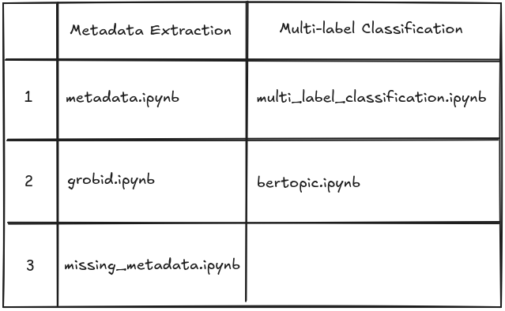

# WordOfChessAndAI

Progetto per Tesi Triennale Informatica per il Management (8014) Anno Accademico (2023/2024)

## Informazioni

### Suddivisione dei notebook

Di seguito seguito è riportato l'ordine cronologico dei file e delle breve osservazioni relative, suddivise in:
- metadata.ipynb, (osservazioni...)
- grobid.ipynb, (osservazioni...)
- multi_label_classification.ipynb, (osservazioni...)
- missing_metadata.ipynb, (osservazioni...)
- bertopic.ipynb, (osservazioni...)

### Installazione delle librerie
Tramite il dependencies manager pip eseguire il comando...